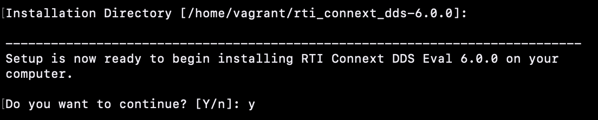

# 1. DDS Introduction

#### `IoT` `DDS` `1_DDS_Introduction`
#### maintainer: B10602126 [Alvin Januar 鄺意凱](https://github.com/jumping-dragon)

## Overview
[Vagrant](https://www.vagrantup.com/) is a development environment provider which works on Mac, Linux, Windows, and more. Remote development environments force users to give up their favorite editors and programs. Vagrant works on your local system with the tools you're already familiar with. Easily code in your favorite text editor, edit images in your favorite manipulation program, and debug using your favorite tools, all from the comfort of your local laptop.

In this tutorial we will learn: 

1. **How to install** [RTI Connext DDS](https://www.rti.com/products) on your own [Vagrant](https://www.vagrantup.com/) Development Environment.
2. **How to learn** the basic structures of DDS from the examples provided by RTI-DDS

## Prerequisites

1. `rti_connext_dds-6.0.0-eval-x64Linux3gcc5.4.0.run`
> Host Evaluation bundles of RTI Connext DDS that are runnable on UNIX-based systems.
	
	or
	
	`rti_connext_dds-6.0.0` (extracted folder)
> This is the extracted version of the Host Evaluation bundles which is also sufficient for our tutorial.

2. `rti_license.dat`
> This is the license of RTI Connext DDS 6.0.0 provided by NTUST

## Step by step

### Vagrant Installation

1. First step is to install [virtualbox](https://www.virtualbox.org/) on your machine, pick your machine OS and continue installation

	

2. Second step of installing is to download it [here](https://www.vagrantup.com/downloads), and then pick your machine OS and continue installation

	

3. To confirm installation try to run the command `vagrant version`, to check for the current version installed on your machine.

	

### Development Environment Creation

1. Within this repo, there is a file called [Vagrantfile](./Vagrantfile) which is the configuration file that vagrant uses to create a dev-environment

	

	This file may look scary at first, but when your realize it, most of it are just comments, the lines that you actually need to worry are: 
	- Ln 10: `config.vm.box` 
		> *config.vm.box* (string) this configures what box the VM will run (ours is bento/ubuntu-16.04)
		
	- Ln 15: `config.vm.network`
		> *config.vm.network* (string) this configures network connection of our real machine to our VM (our is configured to use the public network of our real machine and to use the IP 192.168.0.35)
		
	- Ln 22: `config.vm.synced_folder`
		> *config.vm.synced_folder* (string) this configures the folder that is connected between your VM and your real machine, so that we can edit our source code later from our real machine.
	
	- Ln 25: `config.vm.provider`
		> * config.vm.provider* (string) this tells vagrant the VM provider that we will be using which is Virtualbox
		
2. Now that this file isn't so scary anymore let's run our development environment! by typing the command `vagrant up`		

	

	On halfway it WILL ask for an network interface to bridge to, you need to pick the one that your **REAL MACHINE** uses to **CONNECT TO WI-FI**, after that the creation will continue.
	 
	> for me it is called en0 so I pick '1' as listed
	
	> **WARNING** this might be **DIFFERENT** on your machine to check which interface that you use *ifconfig* on Unix or *ipconfig* on Windows might be useful

	
	
	After that you may notice that our development environment is already running if you open your virtualbox GUI. 

	
	
	<center>CONGRATULATIONS YOU HAVE LEARNED HOW TO BUILD YOUR OWN DEV-ENVIRONMENT WITH VAGRANT </center>
	
---

### RTI-DDS Installation

1. First SSH (Login) to your Ubuntu Vagrant VM by typing the command

	


	```
	vagrant ssh
	```
	when you are asked for password, the default password for vagrant VM is `vagrant` type it and then you will see that you are already inside Ubuntu 16.04!
	
2. Then you will notice that when you list the home files inside the VM it is actually synced with the [home](home) folder on this repo.

	
	
	> If you don't have it then please copy the prerequisites to your home folder on your REAL MACHINE, 
	
	>**WARNING** PICK ONE OF THEM only or else installation will give error
	
3. Run the host evaluation bundle

	> If you already had the extracted folder of `rti_connext_dds-6.0.0` you may skip this step

	
	
	Click `Enter` through the whole terms, until you reach 

	
	
	type `y`, then type `Enter` then `y`
	
	

	then `n` then `n`
	
	

4. DDS Workspace need some environment variables to be defined, we can define it simply by running:

	```
	export NDDSHOME=$HOME/rti_connext_dds-6.0.0
	export PATH=$PATH:$NDDSHOME/bin
	export LD_LIBRARY_PATH=$NDDSHOME/lib/x64Linux3gcc5.4.0
	rtipkginstall
	```

5. Copy the `rti_license.dat` license file provided by NTUST to NDDSHOME folder so that it will verify our version of RTI-DDS

	

---

### Test Helloworld

1. We will run our first Hello World on DDS with the examples written in C from RTI-DDS, run this command to move to the example folder and then make to compile the c program to a executable binary.

	```
	cd $HOME/rti_workspace/6.0.0/examples/connext_dds/c/hello_world
	make -f make/makefile_HelloWorld_x64Linux3gcc5.4.0 
	```
2. Test it by running the executable binary:

	```
	 ./objs/x64Linux3gcc5.4.0/HelloWorld_subscriber <Domain_ID> <Number_of_Samples>
	 ./objs/x64Linux3gcc5.4.0/HelloWorld_publisher <Domain_ID> <Number_of_Samples>
	```

	> **Parameters** :
	> 
	> * `<Domain_ID>`: specific domain ID {default : 0}
	> * `<Number_of_Samples>`: number of samples to publish before terminating. 

The Results:

 
 

<center>CONGRATULATIONS YOU LEARNED Hello World on RTI-DDS </center>
 
*To continue learning you can run other examples provided, by compiling it with the make file, reading the readme.txt, then run the executable binary files*

## Conclusion

1. We have successfully installed and run RTI-DDS Connext 6.0.0 on an Ubuntu VM through Vagrant
2. This Instance will be our development environment for further development,testing & etc
3. You can move on to [2-Dispenser-Implementation](../2_Dispenser_Implementation)

## Cleanup

1. To exit and delete the VM Instance just type `exit`
2. And then type `vagrant destroy` continued with `y`

## References

1. [RTI Connext DDS Official Installation Documentation](https://community.rti.com/static/documentation/connext-dds/6.0.1/doc/manuals/connext_dds/html_files/RTI_ConnextDDS_InstallationGuide/index.htm#InstallationGuide/Installing.htm%3FTocPath%3D_____3)

2. [Hashicorp Vagrant Official Documentation](https://www.vagrantup.com/docs)