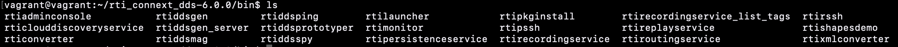
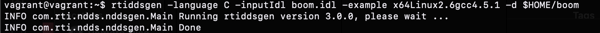
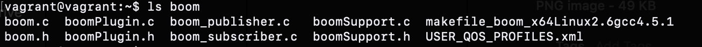
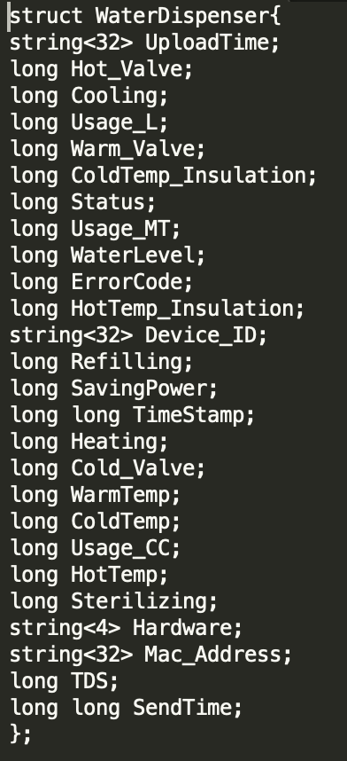

# 2. Dispenser Implementation

#### `IoT` `DDS` `2_Dispenser_Implementation`
#### maintainer: B10602126 [Alvin Januar 鄺意凱](https://github.com/jumping-dragon)

## Overview

In this tutorial we will learn: 

1. How to Generate your own basic DDS Publisher/Subscriber using *rtiddsgen* tool provided by RTI

## Prerequisites

1. Installed Vagrant & RTI Connext DDS 6.0.0 with Valid License File

## Step by step

### Generate your own Basic DDS Publisher Subscriber with rtiddsgen

1. First step is to ssh into your vagrant VM, and then define the required environment variables

	```
	export NDDSHOME=$HOME/rti_connext_dds-6.0.0
	export PATH=$PATH:$NDDSHOME/bin
	export LD_LIBRARY_PATH=$NDDSHOME/lib/x64Linux3gcc5.4.0
	```
	
2. Update & Install G++ for C++ support that RTI-DDS needs by running command :

	```
	sudo apt-get update
	sudo apt-get install g++
	```

3. If you navigate to `$NDDSHOME/bin` and then list the files inside you will see all of the tools provided by RTI-DDS on this bundle of RTI Connext DDS 6.0.0

	
		
	One of the tool that we will use is the [rtiddsgen](https://community.rti.com/rti-doc/45e/ndds.4.5e/doc/html/api_c/group__DDSNddsgenModule.html) tool which is a basic Publish/Subscribe code generator
	
4. Try to generate your own basic publisher/subscriber c code with rtiddsgen by coming up with your own .idl (typedef of struct of your package) on this tutorial we will be using example boom.idl, type the command

	```
	cd
	mkdir $HOME/boom
	rtiddsgen -language C -inputIdl boom.idl -example x64Linux3gcc5.4.0 -d $HOME/boom
	```
	
	> Note You may change boom.idl to your own idl by changing the -inputIdl parameter on your command
	
	
	
	You should notice that inside boom folder you will see that you have successfully generated your own publisher/subscriber inside the `boom` folder.
	
	


<center>CONGRATULATIONS YOU HAVE LEARNED How to Generate your own Basic Publisher/Subscriber Structure with rtiddsgen </center>

-- 

### Understanding the Current Smart Water Dispenser(SWD) DDS Structure

1. Just like how we generated our own basic publisher/subscriber structure, our own SWD DDS structure was actually generated through `rtiddsgen` as well, but in order to match a few extra features we changed some functions within each:

- Our input idl :



## Conclusion

1. We have successfully generated our own basic publisher/subscriber structure with rtiddsgen
2. We have understood the current DDS structure that are being used on the Smart Water Dispenser IoT Project
3. You can move on to [3-Data-Classification](../3_Data_Classification)

## Cleanup

1. To exit and delete the VM Instance just type `exit`
2. And then type `vagrant destroy` continued with `y`

## References

1. [rtiddsgen official documentation](https://community.rti.com/rti-doc/45e/ndds.4.5e/doc/html/api_c/group__DDSNddsgenModule.html)